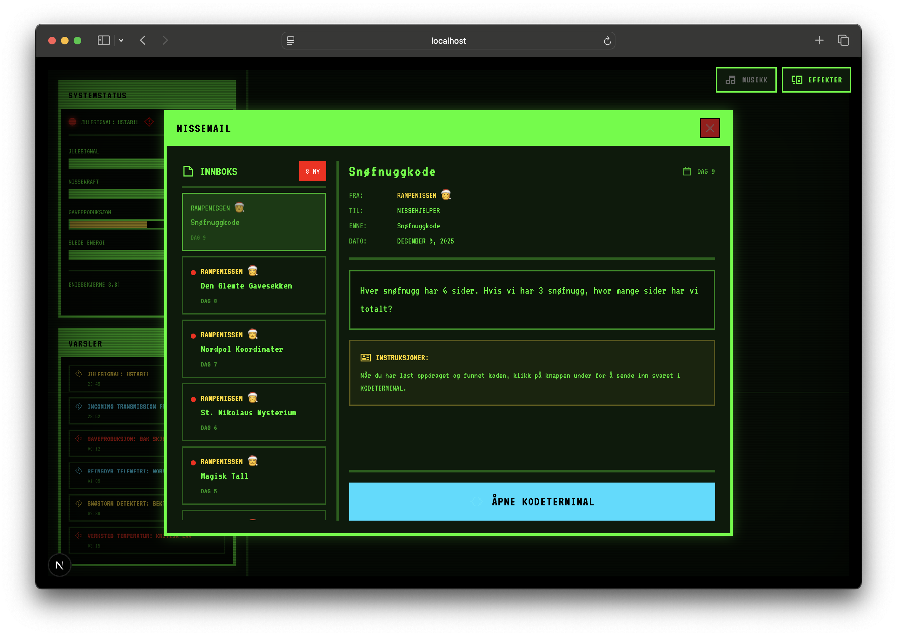

# NisseKomm

En leken julekalender med gåter for barn, designet som et retro CRT-kommandosenter. Kjøres gjennom hele desember (1-24) med daglige gåter og oppdrag.



## Oversikt

**NisseKomm** har en nostalgisk lav-tech, pixelert estetikk inspirert av fiktive dataterminaler fra videospill. Barn løser daglige oppdrag ved å skrive inn koder i et terminalgrensesnitt, låser opp Julius' dagbok og utforsker et juletema filsystem.

## Funksjoner

- **Retro CRT-terminal**: Autentiske skannelinjeeffekter, pixelkanter og vignettoverlegg
- **Daglige oppdrag**: 24 gåter/oppdrag (1-24. desember) levert via NisseMail
- **Kodeterminal**: Send inn koder for å låse opp innhold og komme videre i kalenderen
- **Julius' dagbok**: Dynamisk dagbok som oppdateres daglig med Julius' perspektiv fra Snøfall
- **Filutforsker**: Bla gjennom juletemafiler og -mapper for å finne hint
- **Kalendervisning**: Visuell fremdriftssporing som viser fullførte dager
- **Oppstartssekvens**: Passordbeskyttet system med autentisk terminal-oppstartsanimasjon

## Teknologi

- **Next.js 16** (App Router)
- **React 19**
- **TypeScript** (strict mode)
- **Tailwind CSS v4**
- **Pixelarticons** (retro ikonbibliotek)

## Komme i gang

1. **Installer avhengigheter:**

   ```bash
   npm install
   ```

2. **Opprett `.env.local`-fil** (valgfritt for utvikling):

   ```bash
   # Sett til 'true' for utvikling (omgår datobegrensninger)
   NEXT_PUBLIC_TEST_MODE=true

   # Oppstartspassord (standard: NISSEKODE2025)
   NEXT_PUBLIC_BOOT_PASSWORD=NISSEKODE2025

   # Oppstartsanimasjonens varighet i sekunder (0 = hopp over)
   NEXT_PUBLIC_BOOT_ANIMATION_DURATION=0
   ```

3. **Kjør utviklingsserver:**

   ```bash
   npm run dev
   ```

4. **Åpne [http://localhost:3000](http://localhost:3000)**

   Bruk passordet `NISSEKODE2025` (eller ditt eget hvis du endret det).

## Utvikling

### Kvalitetskontroll

Kjør alle sjekker før du committer:

```bash
npm run check
```

Dette kjører:

- TypeScript type-sjekking
- ESLint linting
- Knip (ubrukte avhengigheter)
- Prettier formatering

### Utviklingsmodus

Når `NEXT_PUBLIC_TEST_MODE=true`:

- Alle 24 dager er tilgjengelige (ikke begrenset til desember)
- Perfekt for testing og utvikling

### Rediger innhold

- **Oppdrag og gåter:** `src/data/uke1_oppdrag.json` through `uke4_oppdrag.json` (loaded and validated by `src/lib/game-engine.ts`)
- **Statisk innhold:** `src/data/statisk_innhold.json`

Alle endringer lastes automatisk når du lagrer.

## Prosjektstruktur

```text
src/
├── app/              # Next.js-sider og globale stiler
├── components/
│   ├── ui/          # Gjenbrukbare UI-komponenter (CRT-ramme, vinduer, ikoner)
│   ├── modules/     # Sidepanel-widgets (systemstatus, varsler)
│   └── windows/     # Hovedapplikasjonsvinduer (e-post, terminal, utforsker, kalender)
├── lib/             # Verktøy (ikoner, lyder, lagringsbehandler)
├── types/           # TypeScript-grensesnitt
└── data/            # Innhold (oppdrag, dagbokinnlegg, filstruktur)
```

## Språk

All UI-tekst, oppdrag og innhold er på **norsk**. Kodekommentarer er på engelsk.

## Design

- **Fargepalett**: Neongrønn (primær), julerød (feil), gull (suksess), kald blå (info)
- **Typografi**: VT323 monospace pixel-font
- **Estetikk**: Leken retro CRT-terminal med overdrevne animasjoner
- **Interaksjon**: Visuell tilbakemelding for hver handling (klikk, hovring, tilstandsendringer)

## Lisens

Se LICENSE-fil for detaljer.
